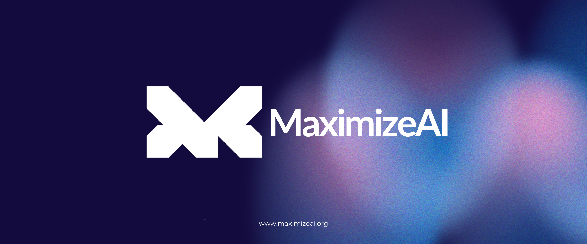

<div align="center">

# **MaximizeAI Subnet** <!-- omit in toc -->
[](https://opensource.org/licenses/MIT) 

### 3D Models,Music,Chat Generator <!-- omit in toc -->
[Website](https://maximizeai.org/) • [App](https://maximizeai.org/playground) • [Telegram](https://t.me/Maximizeai) • [Twitter](https://x.com/Maximize_AI)


</div>


## Introduction

MaximizeAI is a Bittensor subnet dedicated to the 3D Models,Music,Chat Generatorusing advanced maximizeai network techniques. Our goal is to allow developers and artists access to tools that simplify the creation of high-quality 3D Models,Music,Chat for various applications, including gaming, virtual reality, and simulations.

## Key Features

- **Multi-Model Intelligence**: Seamless integration of diverse AI models for superior task execution.
- **Context-Aware Desicion Making**: Smart switching between models based on input type, complexity, and goal.
- **Flexible Architecture**: Easily customizable to specific business needs & scale across use cases.
- **Cross-Model Collaboration**: AI Models work together and share information to improve results.

## MaximizeAI Subnet Setup

This project outlines the steps to research, configure, and deploy a custom Bittensor subnet called **MaximizeAI**. The goal is to understand the Bittensor and Subtensor frameworks and set up a local environment for development, including running a miner and validator.

## Progress Subnet 
 
- ✅ Research **Bittensor** -> May 7th, 2025
- ✅ Research **Subtensor** -> May 16th, 2025
- ✅ Create node (Subtensor) in local/staging environment -> May 26th, 2025
- ✅ Run **miner** on local environment -> May 27th, 2025
- ✅ Run **validator** on local environment -> May 27th, 2025
- ✅ Create custom subnet **MaximizeAI** -> May 28th, 2025

# Miner and Validator Functionality

# Overview
- ⚖️ [Validator](./docs/validator.md)
- ⛏️ [Miner](./docs/miner.md)

This tutorial shows how to  run incentives on it using the our testnet.
**important**.
- Do not expose your private key.
- Use only your testnet wallet.
- Do not reuse your mainnet wallet password.
- Make sure your incentives are resistant to abuse.

## Preparation
#### prepare subnet
```bash
git clone https://github.com/maximizeai-dev/maximizeai-subnet
python3 -m venv btcli_venv
source btcli_venv/bin/activate

# setup bittensor sdk
pip install bittensor
pip install -e .
```
### start miner
```bash
python neurons/miner.py --netuid 367 --subtensor.network test --wallet.name miner --wallet.hotkey miner --logging.debug
```

### start validator
```bash
python neurons/validator.py --netuid 367 --subtensor.network test --wallet.name validator --wallet.hotkey validator --logging.debug 
```
### check state
```bash
btcli wallet overview --wallet.name miner --netuid 367 --subtensor.network test
btcli wallet overview --wallet.name validator --netuid 367 --subtensor.network test
```
